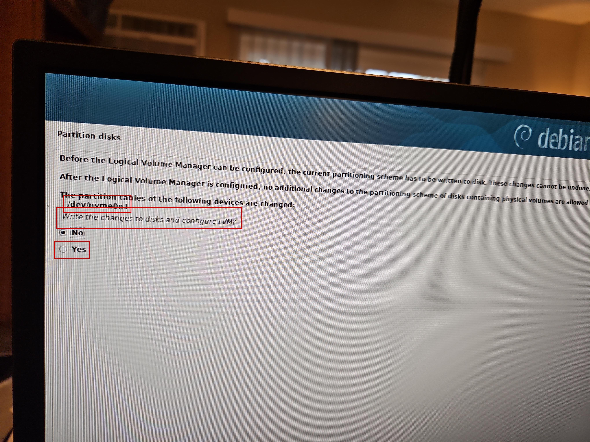
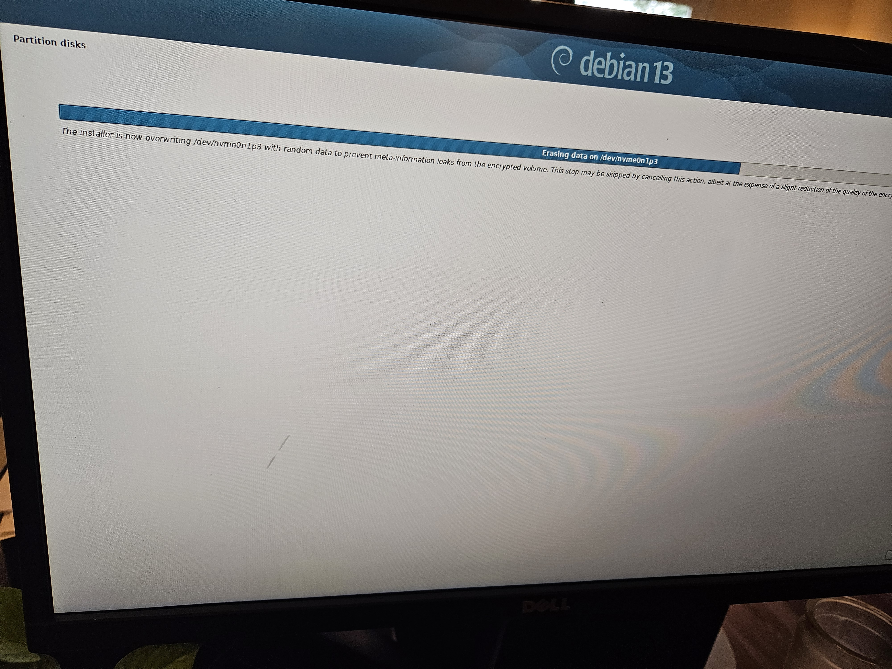
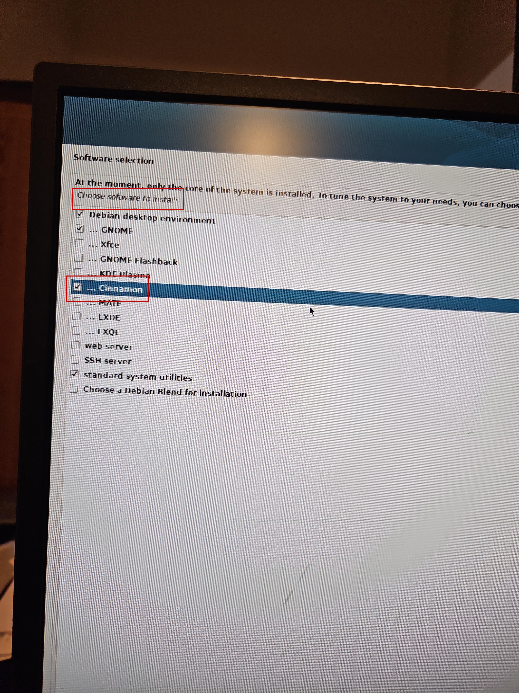
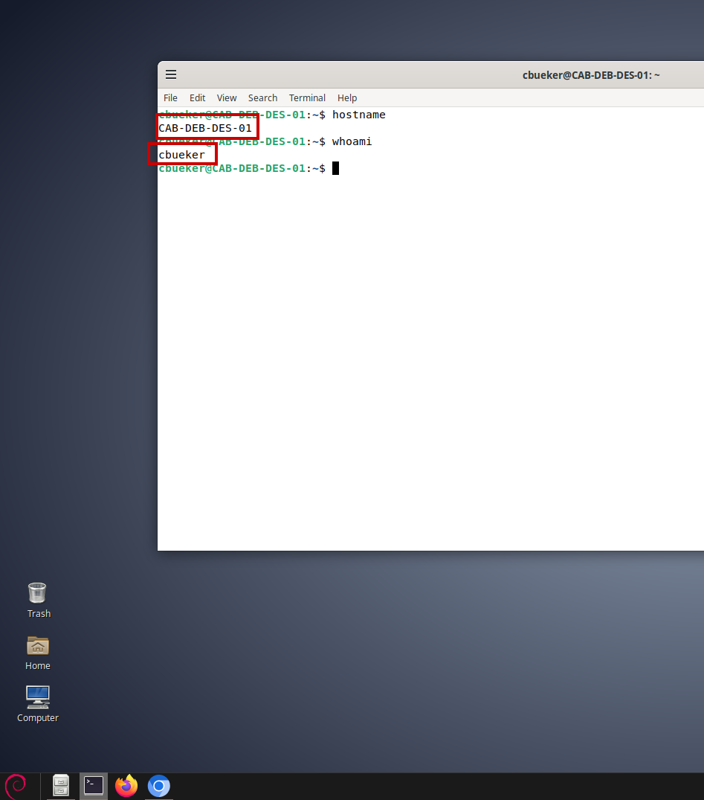
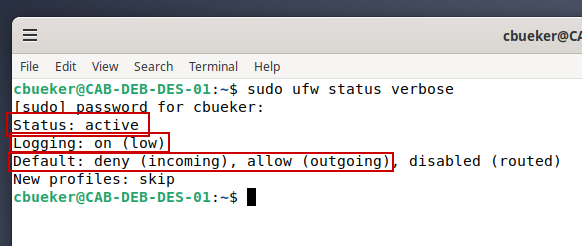
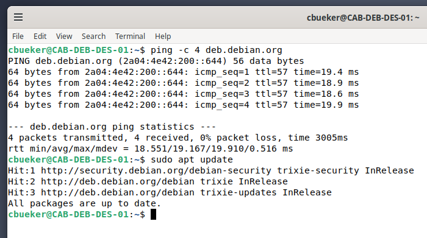
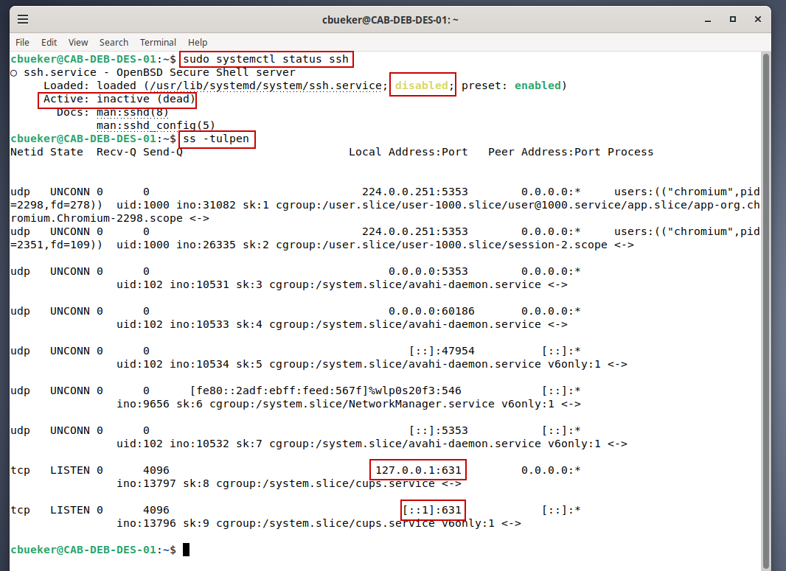

**Debian Secure Build**

Secure Debian 13 Cinnamon workstation deployment with encrypted LVM, UFW firewall, connectivity validation, and SSH exposure remediation.

Project Overview

While working from my Dell Latitude running Ubuntu 24, I ran into a practical workflow problem while building my technical portfolio. The laptop worked, but the 13.3-inch screen was limited for the type of work I was doing. My technical work increasingly requires documentation, screenshot review and GitHub writing at the same time.

The smaller screen slowed down my workflow and created unnesseccary friction. It meant more window switching, more button clicks, and more effort to organize technical documentation efficiently. As my work continued moving toward practical systems administration and information security, I realized that I needed a larger workstation setup that would make it easier to document the work clearly.

My intention was to build the workstation economically while still having enough power to support Linux administration work, documentation, and future virtual machines. I chose an HP EliteDesk Mini because it gave me a small physical footprint, 32 GB of RAM, an Intel i7 10th generation processor, and enough speed, efficiency, and processing power for a practical Linux workstation.

This project documents my secure deployment of a Debian 13 Cinnamon workstation on an HP EliteDesk Mini. My goal was to build a lean, secure, and powerful Linux workstation with encrypted storage, a basic firewall baseline, verified network connectivity, and reduced unnecessary service exposure.

This documentation is written to reflect a repeatable technical work instruction. I included key screenshots as evidence of important configuration and validation steps.

Objectives

- Deploy Debian 13 on physical workstation hardware.
- Configure encrypted LVM during installation.
- Verify the final partition layout before completing installation.
- Install a desktop workstation environment.
- Confirm successful first boot, hostname, and user account.
- Enable a baseline UFW firewall policy.
- Validate outbound network and package repository access.
- Disable SSH when remote access is not required.
- Review listening ports after service changes.

Environment

- Primary system: HP EliteDesk Mini
- Processor: Intel Core i7 10th generation
- Memory: 32 GB RAM
- Storage: 256GB NVMe SSD
- Operating system: Debian 13
- Desktop environment: Cinnamon
- Storage configuration: Encrypted LVM
- Firewall: UFW
- Network: Wireless home network
- Installation media: Bootable Debian USB installer
- Display: Dell 21.5-inch monitor
- Display connection: DisplayPort cable
- Spekarer: Logitech speakers via audio jack
- Audio input: TONOR TC-30 USB condenser microphone
- Input devices: Wired USB keyboard and mouse
- Power: 90-watt HP EliteDesk power adapter and monitor power cable
- Workstation mount: Desk-mounted monitor arm

My new workstation was built as an economical desktop setup without compromising the power, speed, and reliability needed for practical technical work. I used a small-form-factor HP EliteDesk Mini along with practical accessories acquired through eBay, Amazon, and Walmart to create a larger and more capable Linux workstation environment.

This setup supports Linux administration work, technical documentation, screenshot review, GitHub writing, and future virtualization labs.

Prepare Installation Media and Hardware

- Create a bootable Debian 13 USB installer using a USB drive.
- Connect the HP EliteDesk Mini to the monitor.
- Connect the wired USB keyboard.
- Connect the mouse.
- Connect the HP power adapter.
- Insert the Debian USB installer.
- Power on the HP EliteDesk Mini.
- Open the HP boot menu.
- Select the Debian USB installer from the UEFI boot options.
- Launch the Debian graphical installer.
- Select language, location, and keyboard settings.
- Configure wireless networking for the installer.
- Configure the hostname as CAB-DEB-DES-01.
- Leave the domain name blank because the system is not joined to an organizational domain.
- Open the disk partitioning step.
- Select guided partitioning with encrypted LVM.

LVM Write Confirmation

- Select the internal NVMe drive as the Debian installation target.
- Confirm the installer is applying partition changes to `/dev/nvme0n1`.
- Approve writing partition changes to disk.
- Begin Logical Volume Manager configuration.
- `/dev/nvme0n1` identifies the internal NVMe drive receiving the partition changes.
- `Write the changes to disks and configure LVM?` shows the installer confirmation prompt before disk changes are committed.
- `Yes` shows the approval option used to continue with LVM configuration.

Encrypted Volume Randomization

- Create the encrypted partition on the internal NVMe drive.
- Enter and confirm the encrypted volume passphrase.
- Allow Debian to overwrite `/dev/nvme0n1p3` with random data.
- Continue encrypted volume preparation before filesystem creation.
- The installer message shows Debian overwriting `/dev/nvme0n1p3` with random data.
- `Erasing data on /dev/nvme0n1p3` confirms the specific encrypted partition being prepared.
- The progress bar shows the randomization process running during encrypted volume setup.

Final Encrypted Partition Layout

- Review the final partition layout before completing disk partitioning.
- Confirm the EFI System Partition is present.
- Confirm the separate `/boot` partition is present.
- Confirm the encrypted volume is present.
- Confirm the LVM root volume is mounted at `/`.
- Confirm the swap volume is present.
- Confirm the SanDisk USB installer is listed separately from the internal NVMe drive.
- Finish partitioning and write changes to disk.
- `/dev/nvme0n1` identifies the internal NVMe drive used for the Debian installation.
- The LVM root and swap entries show the logical volumes created inside the encrypted storage layout.
- `Encrypted volume (nvme0n1p3_crypt)` shows the encrypted container used for the workstation installation.
- `Finish partitioning and write changes to disk` shows the final confirmation step before completing disk partitioning.

Workstation Software Selection

- Select the Debian desktop environment.
- Select Cinnamon for the workstation desktop environment.
- Select standard system utilities.
- Leave web server unchecked.
- Leave SSH server unchecked during installation.
- Continue the Debian software installation.
- Complete the installation.
- Remove the USB installation media.
- Reboot into the installed Debian system.
- `Choose software to install` identifies the installer stage used to select workstation software.
- `Cinnamon` shows the desktop environment selected for the Debian workstation.
- Unchecked server roles show the system was not configured as a web server or SSH server during installation.
- `standard system utilities` shows standard Debian system tools were included.

First Boot Hostname and User Verification

- Boot into the installed Debian system.
- Enter the encryption passphrase during startup.
- Log into the Debian desktop.
- Open Terminal.
- Run `hostname`.
- Confirm the hostname is `CAB-DEB-DES-01`.
- Run `whoami`.
- Confirm the active user is `cbueker`.
- `CAB-DEB-DES-01` confirms the configured workstation hostname.
- `cbueker` confirms the active logged-in user account.

UFW Firewall Baseline

- Install UFW by running `sudo apt install ufw`.
- Check the firewall status by running `sudo ufw status verbose`.
- Confirm UFW is installed before applying firewall rules.
- Set the default incoming policy by running `sudo ufw default deny incoming`.
- Set the default outgoing policy by running `sudo ufw default allow outgoing`.
- Enable the firewall by running `sudo ufw enable`.
- Verify the active firewall configuration by running `sudo ufw status verbose`.
- Confirm UFW is active.
- Confirm firewall logging is enabled.
- Confirm incoming traffic is denied by default.
- Confirm outgoing traffic is allowed by default.
- `Status: active` confirms the firewall is enabled.
- `Logging: on (low)` confirms firewall logging is active.
- `Default: deny (incoming), allow (outgoing)` confirms the baseline workstation firewall policy.
- `New profiles: skip` confirms no new application profiles were automatically applied.

Network Connectivity Confirmation

- Run `ping -c 4 deb.debian.org`.
- Confirm Debian receives responses from `deb.debian.org`.
- Confirm the ping test reports `0% packet loss`.
- Run `sudo apt update`.
- Confirm Debian repositories are reachable.
- Confirm package metadata is current.
- Confirm the firewall does not block normal outbound traffic.
- `ping -c 4 deb.debian.org` shows the command used to test outbound network connectivity.
- The response times show successful replies from `deb.debian.org`.
- `4 packets transmitted, 4 received, 0% packet loss` confirms successful connectivity.
- `sudo apt update` shows the command used to test package repository access.
- `All packages are up to date` confirms APT successfully reached Debian repositories.

SSH Disabled and Port Review

- Review listening services with `ss -tulpen`.
- Identify SSH listening on port 22.
- Disable and stop SSH because remote access is not required for the baseline workstation.
- Run `sudo systemctl status ssh`.
- Confirm SSH is disabled.
- Confirm SSH is inactive.
- Rerun `ss -tulpen`.
- Confirm port 22 is no longer listening.
- Confirm remaining visible listening services are limited to expected local services, such as CUPS on localhost.
- `sudo systemctl status ssh` shows the command used to verify SSH service status.
- `disabled` confirms SSH is not configured to start automatically.
- `Active: inactive (dead)` confirms SSH is not currently running.
- `ss -tulpen` shows the command used to review listening sockets.
- `127.0.0.1:631` and `[::1]:631` show CUPS listening only on localhost.
- The absence of port `22` in the socket review confirms SSH is no longer exposed.

